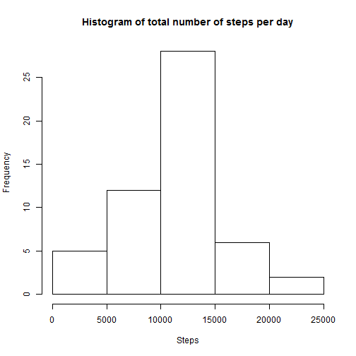
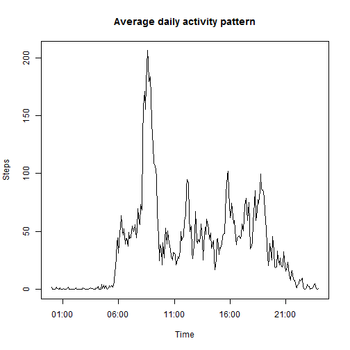
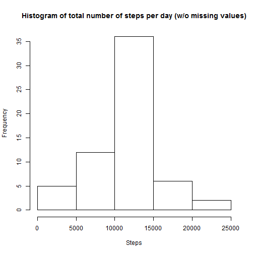
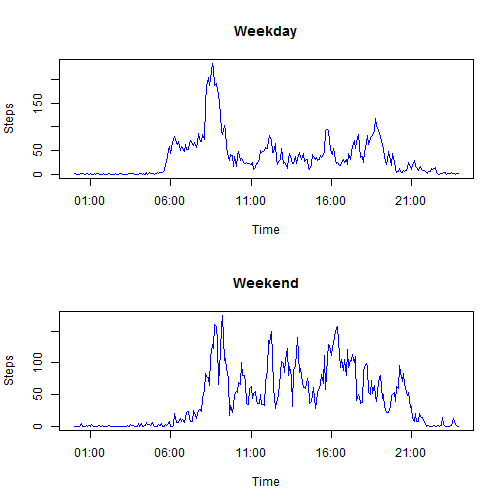

# Reproducible Research: Peer Assessment 1


## Loading and preprocessing the data
The following code reads file from 'activity.csv' in 'activity.zip' archive file. Then 'date' and 'interval' columns are converted to date. The resulting data frame 'data' contains 4 columns: date, dateTime, time, steps.

```r
conn <- unz(description='activity.zip', filename="activity.csv")
open(conn)
rawData <- read.csv(file=conn, header=TRUE)
close(conn)

dateText <- paste(rawData$date, floor(rawData$interval / 100), rawData$interval %% 100)
dateTime <- strptime(dateText, format="%Y-%m-%d %H %M")
time <- strptime(format(dateTime, "%H:%M:%S"), format="%H:%M:%S")

data <- data.frame(Date = rawData$date, DateTime = dateTime, Time = time, Steps = rawData$steps)
```


## What is mean total number of steps taken per day?
The following code sums number of steps for each day, produces a data frame 'dailySteps' with 2 columns: date and total number of steps that were recorded this day, plots a histogram of total number of steps per day and calculates mean and median number of steps per day.

```r
dailySteps <- aggregate(formula = Steps ~ Date, data = data, FUN = sum)
meanSteps <- mean(dailySteps$Steps)
medianSteps <- median(dailySteps$Steps)
with(dailySteps, hist(Steps, main="Histogram of total number of steps per day"))
```

 

Mean number of steps per day is 10766. Median number of steps per day is 10765.


## What is the average daily activity pattern?
The following code averages numer of steps for each time interval and produces a plot of average daily activity pattern.

```r
stepsByTime <- aggregate(formula = Steps ~ Time, data = data, FUN = mean)
with(stepsByTime, plot(Time, Steps, type="l", main="Average daily activity pattern"))
```

 

Time of maximum average activity can be found with the following code:

```r
timeMaxSteps <- stepsByTime$Time[which.max(stepsByTime$Steps)]
```
Maximum average number of steps is recorded at 08:35.

## Imputing missing values
The following code computes total number of missing values in the dataset.

```r
totalNA = sum(is.na(data$Steps))
```
Total number of missing values is 2304.

Mean number of steps in the time interval (averaged by days) is used to replace missing values. The following code produces dataset without missing values.

```r
dataNoNA <- data
for (i in which(is.na(dataNoNA$Steps))) {
  dataNoNA$Steps[i] <- stepsByTime$Steps[stepsByTime$Time == dataNoNA$Time[i]]
}
```

The following code produces histogram of total number of steps per day and calculates mean and median values of total number of steps per day for dataset with missing values replaced.

```r
dailyStepsNoNA <- aggregate(formula = Steps ~ Date, data = dataNoNA, FUN = sum)
meanStepsNoNA <- mean(dailyStepsNoNA$Steps)
medianStepsNoNA <- median(dailyStepsNoNA$Steps)
with(dailyStepsNoNA, hist(Steps, main="Histogram of total number of steps per day (w/o missing values)"))
```

 

Mean number of steps per day for this dataset is 10766. Median number of steps per day is 10766. The mean and median number of steps per day is almost the same as for original dataset.
## Are there differences in activity patterns between weekdays and weekends?
The following code averages number of steps in all time interval for weekdays and weekends and plots comparison of activity patterns.

```r
isWeekend <- weekdays(data$DateTime) %in% c("Saturday", "Sunday")
dataWeekend <- aggregate(formula = Steps ~ Time, data = data[isWeekend, ], FUN = mean)
dataWeekday <- aggregate(formula = Steps ~ Time, data = data[!isWeekend, ], FUN = mean)
par(mfrow=c(2,1))
with(dataWeekday, plot(Time, Steps, type="l", col="blue", main="Weekday"))
with(dataWeekend, plot(Time, Steps, type="l", col="blue", main="Weekend"))
```

 

The plot shows that on weekdays number of steps is larger in the morning but smaller in the noon.
